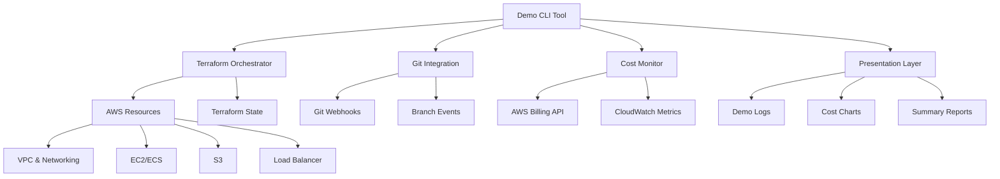

# Design Document: Ephemeral Deployment Demo

## Overview

The Ephemeral Deployment Demo is a comprehensive system that showcases the benefits of using Terraform and AWS to create temporary, on-demand environments for development and testing. The system demonstrates infrastructure-as-code principles, automated lifecycle management, cost optimization, and Git integration to provide a compelling proof-of-concept for ephemeral environment adoption.

The demo consists of a CLI tool that orchestrates Terraform deployments, monitors costs, integrates with Git workflows, and provides clear presentation output suitable for team demonstrations. The system emphasizes practical benefits including rapid provisioning, consistent environments, automatic cleanup, and cost transparency.

## Architecture

The system follows a modular architecture with clear separation of concerns:



### Key Architectural Decisions

1. **CLI-First Design**: The demo is built as a command-line tool to provide clear, step-by-step output suitable for live demonstrations
2. **Terraform Modules**: Infrastructure is organized into reusable Terraform modules for different environment types
3. **State Management**: Remote state storage in S3 with DynamoDB locking to support concurrent operations
4. **Event-Driven Cleanup**: Git webhook integration triggers automatic environment destruction
5. **Cost Transparency**: Real-time cost monitoring with detailed reporting and projections

## Components and Interfaces

### Demo CLI Tool

The main orchestration component that provides the user interface and coordinates all other components.

**Key Functions:**
- `provision_environment(branch_name, config)` - Creates new ephemeral environment
- `destroy_environment(environment_id)` - Tears down environment and all resources
- `monitor_costs(environment_id)` - Tracks and reports resource costs
- `generate_demo_report()` - Creates presentation-ready summary

**Configuration:**
- Environment templates (web app, API, database)
- AWS region and resource sizing options
- Cost thresholds and alerting rules
- Git repository integration settings

### Terraform Orchestrator

Manages infrastructure provisioning and destruction using modular Terraform configurations.

**Terraform Modules:**
- `networking` - VPC, subnets, security groups, NAT gateway
- `compute` - EC2 instances or ECS services for application hosting
- `storage` - S3 buckets for static assets and application data
- `monitoring` - CloudWatch dashboards and alarms
- `dns` - Route53 records for environment access

**State Management:**
- Remote backend using S3 bucket with versioning enabled
- DynamoDB table for state locking
- Environment-specific state files using workspace isolation

**Resource Tagging Strategy:**
```hcl
default_tags = {
  Environment = var.environment_name
  Project     = "ephemeral-demo"
  Branch      = var.git_branch
  Owner       = var.creator
  Purpose     = "demo"
  AutoDestroy = "true"
}
```

### Git Integration Component

Monitors Git repository events and triggers environment lifecycle actions.

**Webhook Handler:**
- Listens for pull request events (opened, closed, merged)
- Validates webhook signatures for security
- Maps Git branches to environment identifiers
- Triggers appropriate lifecycle actions

**Branch Mapping:**
- Maintains database of branch-to-environment relationships
- Handles branch name sanitization for AWS resource naming
- Tracks environment metadata (creation time, cost, status)

**Event Processing:**
- Pull request opened → Create new environment
- Pull request merged → Schedule environment destruction
- Pull request closed → Immediate environment cleanup
- Branch deleted → Force cleanup with verification

### Cost Monitor

Tracks AWS resource costs and provides detailed reporting for demonstration purposes.

**Cost Tracking:**
- Real-time cost monitoring using AWS Cost Explorer API
- Resource-level cost attribution using tags
- Historical cost data collection and analysis
- Cost projection based on usage patterns

**Reporting Features:**
- Environment-specific cost breakdowns
- Comparison between ephemeral and persistent environment costs
- Cost per hour/day calculations
- Resource utilization metrics

**Alerting:**
- Configurable cost thresholds per environment
- Automatic notifications when limits are exceeded
- Integration with environment auto-destruction policies

### Sample Application Deployment

Demonstrates real-world application deployment to ephemeral environments.

**Application Types:**
- Simple web application (React/Vue frontend)
- REST API backend (Node.js/Python)
- Database integration (RDS or containerized)
- Static site hosting (S3 + CloudFront)

**Deployment Pipeline:**
- Application build and packaging
- Container image creation and push to ECR
- Database migration and seeding
- Health check verification
- URL generation and access validation

## Data Models

### Environment Configuration

```typescript
interface EnvironmentConfig {
  name: string;
  branch: string;
  template: 'webapp' | 'api' | 'fullstack';
  region: string;
  instanceType: string;
  autoDestroy: boolean;
  maxLifetime: number; // hours
  costThreshold: number; // USD
  tags: Record<string, string>;
}
```

### Environment State

```typescript
interface EnvironmentState {
  id: string;
  name: string;
  status: 'creating' | 'ready' | 'destroying' | 'destroyed' | 'failed';
  branch: string;
  createdAt: Date;
  destroyAt?: Date;
  urls: {
    application?: string;
    monitoring?: string;
  };
  costs: {
    current: number;
    projected: number;
    breakdown: ResourceCost[];
  };
  resources: TerraformResource[];
}
```

### Cost Tracking

```typescript
interface ResourceCost {
  resourceId: string;
  resourceType: string;
  service: string;
  cost: number;
  unit: string;
  timeframe: string;
}

interface CostReport {
  environmentId: string;
  totalCost: number;
  dailyCost: number;
  projectedMonthlyCost: number;
  resources: ResourceCost[];
  comparisonData: {
    persistentEnvironmentCost: number;
    savingsPercentage: number;
  };
}
```

## Correctness Properties

*A property is a characteristic or behavior that should hold true across all valid executions of a system-essentially, a formal statement about what the system should do. Properties serve as the bridge between human-readable specifications and machine-verifiable correctness guarantees.*

### Property 1: Environment Provisioning Completeness
*For any* valid environment configuration, provisioning should create all required AWS resources (VPC, subnets, security groups, compute instances) and complete within the specified time limit
**Validates: Requirements 1.1, 1.2**

### Property 2: Resource Cleanup Completeness  
*For any* environment that has been destroyed, all AWS resources should be completely removed with no remaining billable resources
**Validates: Requirements 3.1, 3.2**

### Property 3: Application Deployment and Accessibility
*For any* successfully provisioned environment, the deployed application should be accessible via the provided public URL and respond with successful HTTP status codes
**Validates: Requirements 2.1, 2.2, 2.3**

### Property 4: Environment Naming Uniqueness
*For any* set of concurrent environment creation requests, each environment should receive a unique name that avoids AWS resource naming conflicts
**Validates: Requirements 1.5**

### Property 5: Cost Tracking Accuracy
*For any* running environment, the cost tracker should provide real-time cost data and generate accurate final cost reports upon environment destruction
**Validates: Requirements 4.1, 4.2**

### Property 6: Git Event Processing
*For any* Git branch lifecycle event (merge, deletion), the system should correctly identify the associated environment and trigger appropriate cleanup actions
**Validates: Requirements 7.1, 7.2, 7.3**

### Property 7: Error Handling and Recovery
*For any* operation failure (provisioning, deployment, or destruction), the system should provide detailed error information and perform appropriate cleanup or retry actions
**Validates: Requirements 1.4, 2.4, 3.4**

### Property 8: Configuration Validation
*For any* environment configuration input, the system should validate all settings before attempting deployment and reject invalid configurations with clear error messages
**Validates: Requirements 6.4**

### Property 9: Timeout-Based Cleanup
*For any* environment that exceeds its configured idle timeout, the system should automatically trigger destruction and verify complete resource removal
**Validates: Requirements 3.3**

### Property 10: Demo Output Completeness
*For any* demo execution, the system should provide step-by-step progress output, key metrics highlighting, and a comprehensive summary report
**Validates: Requirements 5.1, 5.2, 5.3, 5.4**

## Error Handling

The system implements comprehensive error handling across all components to ensure reliable operation and clear feedback during demonstrations.

### Infrastructure Provisioning Errors
- **Terraform Failures**: Capture and parse Terraform error output, provide actionable error messages
- **AWS API Errors**: Handle rate limiting, permission issues, and resource conflicts gracefully
- **Partial Provisioning**: Implement cleanup procedures for partially created resources
- **State Corruption**: Detect and recover from Terraform state inconsistencies

### Application Deployment Errors
- **Build Failures**: Capture build logs and provide clear error reporting
- **Container Issues**: Handle image pull failures, container startup problems
- **Health Check Failures**: Retry logic with exponential backoff for application readiness
- **Network Connectivity**: Validate security group rules and network configuration

### Git Integration Errors
- **Webhook Failures**: Implement retry logic for webhook delivery failures
- **Authentication Issues**: Handle Git repository access problems gracefully
- **Branch Mapping Errors**: Validate branch-to-environment relationships
- **Event Processing**: Queue and retry Git event processing with dead letter handling

### Cost Monitoring Errors
- **API Limitations**: Handle AWS Cost Explorer API rate limits and data delays
- **Data Inconsistencies**: Validate cost data and handle missing or delayed billing information
- **Threshold Violations**: Implement escalating alert mechanisms for cost overruns

### Recovery Strategies
- **Automatic Retry**: Exponential backoff for transient failures
- **Manual Intervention**: Clear escalation paths when automatic recovery fails
- **State Reconciliation**: Periodic validation of actual vs. expected resource state
- **Rollback Procedures**: Safe rollback mechanisms for failed deployments

## Testing Strategy

The testing strategy employs both unit tests and property-based tests to ensure comprehensive coverage and system reliability.

### Unit Testing Approach
Unit tests focus on specific examples, edge cases, and integration points:

- **Configuration Validation**: Test specific configuration scenarios and validation rules
- **Error Handling**: Test specific error conditions and recovery mechanisms  
- **Git Integration**: Test webhook processing and branch mapping logic
- **Cost Calculations**: Test cost calculation algorithms with known input/output pairs
- **CLI Output**: Test specific output formatting and presentation logic

### Property-Based Testing Approach
Property-based tests verify universal properties across all inputs using a minimum of 100 iterations per test:

- **Environment Lifecycle**: Test provisioning and cleanup across random configurations
- **Resource Management**: Verify complete resource creation and destruction
- **Cost Tracking**: Test cost monitoring accuracy across different resource types
- **Git Event Processing**: Test branch event handling across various Git workflows
- **Configuration Handling**: Test validation across all possible configuration combinations

### Testing Framework
The system uses **Hypothesis** (Python) for property-based testing, configured as follows:
- Minimum 100 iterations per property test
- Each test tagged with: **Feature: ephemeral-deployment-demo, Property {number}: {property_text}**
- Custom generators for AWS resource configurations, Git events, and cost data
- Integration with AWS LocalStack for isolated testing

### Test Environment Setup
- **LocalStack**: Simulate AWS services for unit and integration testing
- **Git Test Repository**: Dedicated test repository for Git integration testing
- **Mock Cost Data**: Simulated AWS billing data for cost tracking tests
- **Terraform Testing**: Use Terraform's built-in testing framework for module validation

### Continuous Integration
- **Pre-commit Hooks**: Run unit tests and linting before commits
- **Pull Request Testing**: Full test suite execution including property tests
- **Integration Testing**: End-to-end testing in isolated AWS accounts
- **Performance Testing**: Validate provisioning time requirements under load